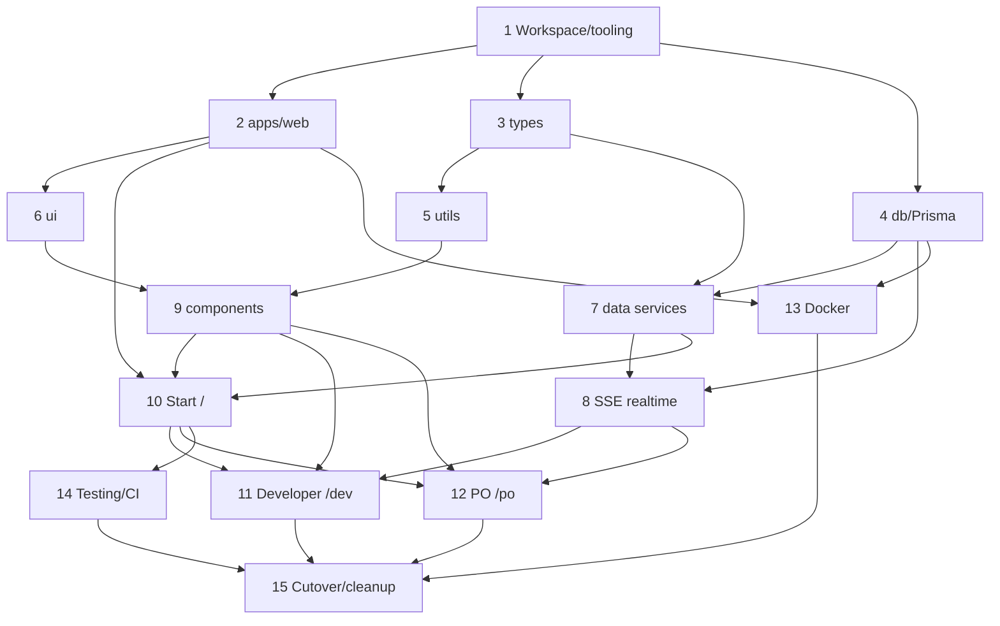

# Scrum Poker — Migration to Next.js 16 + Tailwind + Prisma 7 + SSE Realtime

**Date:** 2026-07-21
**Status:** Approved design (pre-implementation)
**Author:** Brainstormed with @krizic

## Problem statement

The current Scrum Poker app is a Create React App (`react-scripts`) SPA using React 18,
TypeScript 4, `react-router-dom` v6, Semantic UI React + SCSS, and PouchDB syncing to a
remote CouchDB/`pouchdb-server` for real-time updates. It is deployed as a static bundle via
`gh-pages`. We want to migrate to a modern, real-time solution built on **Next.js 16**,
**Tailwind CSS**, **Prisma 7**, and **TypeScript**, organized as a **pnpm workspace monorepo**
and deployed as a **self-hosted Docker Node service**.

This is a large overhaul, sequenced into independently reviewable phases. Each phase becomes a
tracked GitHub issue (drafts produced by the Project Manager agent; not written to GitHub yet).

## Goals

- Preserve current product behavior: create/join a session by PIN, developers vote on
  estimations, product owner manages estimations, reveals votes, sees stats, imports via CSV.
- Replace the PouchDB/CouchDB live change feed with a self-contained real-time transport.
- Modernize the stack and codebase into a modular, scalable pnpm monorepo.

## Non-goals

- No real user accounts / authentication (keep lightweight identity).
- No migration of existing CouchDB session data (poker sessions are ephemeral).
- No unrelated feature additions or refactors beyond what the migration requires.

## Decisions (settled during brainstorming)

| Topic | Decision |
| --- | --- |
| Framework | Next.js 16, App Router, React 19, Server Components default, Turbopack |
| Language | TypeScript (strict) |
| Styling | Tailwind CSS + centralized theme tokens; **remove** Semantic UI React + SCSS; rebuild primitives on Radix in `packages/ui` |
| ORM / DB | Prisma 7 + PostgreSQL |
| Real-time | Server-Sent Events (SSE) backed by Postgres `LISTEN/NOTIFY` (`pg_notify` via DB triggers) |
| Identity | Lightweight: username + email/gravatar + session PIN, client-side; no accounts |
| Repo structure | pnpm workspace monorepo (`apps/*` + `packages/*`) |
| Prisma location | Dedicated `packages/db` (only package importing `@prisma/client`) |
| Deploy | Self-hosted Docker: Next.js standalone Node server + Postgres (compose) |
| Data migration | None — start fresh on Postgres |
| Charts / CSV / errors | Keep `@nivo/pie`, `papaparse`, Sentry (Next.js SDK) |

## Target architecture

- **Framework:** Next.js 16 App Router; Server Components by default, `"use client"` opt-in.
  Request APIs (`cookies()`, `headers()`, `params`, `searchParams`) are async — await them.
- **Styling:** Tailwind with a shared preset in `packages/config`; all colors, spacing, radii,
  shadows, gradients, and motion live as centralized theme tokens. No inline styles, no SCSS,
  no CSS-in-JS. Icons via `lucide-react`.
- **Data:** PostgreSQL via Prisma 7. Domain: `Session → Estimation → Vote` (normalized from the
  current nested CouchDB document).
- **Real-time:** SSE route handler backed by Postgres `LISTEN/NOTIFY`. DB triggers call
  `pg_notify('session_<id>', payload)` on writes; a per-process listener fans out to subscribed
  SSE clients for that session.
- **Identity:** username + email/gravatar + session PIN, stored client-side (localStorage);
  no accounts.
- **Deploy:** Docker image running the Next.js standalone server (long-lived Node runtime,
  required for SSE + `LISTEN/NOTIFY`) alongside Postgres via `docker-compose`.

## Monorepo layout (pnpm workspace)

```
scrum-poker/
├─ apps/
│  └─ web/                  # Next.js 16 app (App Router)
│     ├─ app/               # routes: / , /dev , /po  + api/*
│     └─ Dockerfile
├─ packages/
│  ├─ db/                   # Prisma 7: schema.prisma, migrations, seed, client singleton,
│  │                        #   pg_notify triggers + realtime notify helpers
│  ├─ ui/                   # Tailwind primitives on Radix (Button, Card, Modal, Table, Reveal…)
│  ├─ components/           # composed app components (poker-card, votes-table, charts…)
│  ├─ types/                # shared domain types (Session, Estimation, Vote)
│  ├─ utils/                # pure helpers (stats, formatting, csv parse)
│  └─ config/               # shared tsconfig, eslint, tailwind preset
├─ pnpm-workspace.yaml
├─ docker-compose.yml       # web + postgres
└─ turbo.json               # optional task runner
```

- Internal deps use the `workspace:*` protocol; scoped package names `@scrum-poker/*`.
- Dependency graph is a DAG: `apps/web → components → ui`, `apps/web → db`, all → `types` /
  `utils` / `config`. No cycles.
- `packages/db` is the **only** package importing `@prisma/client`; consumed server-side only.

## Data model (Prisma / Postgres)

```prisma
model Session {
  id          String       @id @default(uuid())
  name        String?
  pin         String?
  createdAt   DateTime     @default(now())
  lastUpdated DateTime     @updatedAt
  estimations Estimation[]
}

model Estimation {
  id          String   @id @default(uuid())
  session     Session  @relation(fields: [sessionId], references: [id], onDelete: Cascade)
  sessionId   String
  name        String
  description String?
  isActive    Boolean  @default(false)
  isEnded     Boolean  @default(false)
  createdAt   DateTime @default(now())
  votes       Vote[]
  @@index([sessionId])
}

model Vote {
  id           String     @id @default(uuid())
  estimation   Estimation @relation(fields: [estimationId], references: [id], onDelete: Cascade)
  estimationId String
  voterId      String     // client-generated identity id
  voterName    String
  voterEmail   String
  pattern      String
  value        String?
  createdAt    DateTime   @default(now())
  @@unique([estimationId, voterId])   // one vote per user per estimation
  @@index([estimationId])
}
```

- "Only one active estimation per session" is enforced in a service/transaction (activating one
  estimation sets all others in the session inactive).
- A Postgres trigger calls `pg_notify('session_<id>', payload)` on `Session` / `Estimation` /
  `Vote` changes to feed the SSE layer. Payloads are small event descriptors (e.g.
  `{ type: 'vote', estimationId }`), not full state.

## Real-time design (SSE + LISTEN/NOTIFY)

**Write path:** client action → Server Action / route handler → Prisma write → DB trigger runs
`pg_notify('session_<id>', json)`.

**Read path:** browser opens `GET /api/sessions/[id]/stream` (SSE, `EventSource`). The handler
uses one dedicated long-lived `pg` client per Node process that `LISTEN`s to session channels and
fans out notifications to all connected SSE responses for that session via an in-memory pub/sub
hub (`sessionId → Set<subscriber>`).

**Details:**
- One shared listener connection per process (not per client).
- Heartbeat comment every ~25s to keep proxies/connections alive; client auto-reconnects
  (`EventSource`) using `Last-Event-ID`.
- Requires a long-lived Node runtime — satisfied by the Docker deploy.
- Cleanup: remove subscriber and `UNLISTEN` when no clients remain for a session.
- Replaces `ApiService.onChange` (PouchDB live changes) 1:1 in behavior. On a notification the
  client revalidates (e.g. `router.refresh()` / SWR) or receives the changed slice.

## Routes

- `/` — Start: create or join a session by PIN; capture/store local identity.
- `/dev` — Developer: vote on the active estimation; live updates via SSE.
- `/po` — Product Owner: create/manage estimations, activate/reveal, view stats
  (`@nivo/pie`), import estimations via CSV (`papaparse`).

## Error handling & testing

- **Errors:** Sentry via the official Next.js SDK (client + server). SSE stream errors surface as
  reconnect attempts; write failures surface as user-facing toasts.
- **Testing:** Jest + `@testing-library/react` per package (utils pure-function tests, component
  render tests, service/data tests). Workspace-level `pnpm -r test`; CI via GitHub Actions.
- For behavior changes, add at least the happy path plus the most important edge case
  (e.g. one-vote-per-user uniqueness, single-active-estimation invariant).

## Migration phases → issue breakdown

**Epic:** Migrate Scrum Poker to Next.js 16 + Tailwind + Prisma 7 + SSE realtime (pnpm monorepo,
Docker).

Sizes are rough and non-binding: XS (<½d), S (~1d), M (~2–3d), L (~1wk).

1. **Scaffold pnpm workspace & tooling** — `pnpm-workspace.yaml`, `packages/config`
   (tsconfig/eslint/tailwind preset), root scripts, turbo. *(S)*
2. **Scaffold `apps/web` Next.js 16** — App Router, Tailwind wired to shared preset, Sentry Next
   SDK, env conventions (`NEXT_PUBLIC_*`). *(M, dep: 1)*
3. **`packages/types`** — port `Session/Estimation/Vote` domain types. *(XS, dep: 1)*
4. **`packages/db` — Prisma 7 + Postgres** — schema, migrations, seed, client singleton,
   `pg_notify` triggers. *(M, dep: 1)*
5. **`packages/utils`** — port stats/formatting + CSV (papaparse) helpers with tests.
   *(S, dep: 3)*
6. **`packages/ui`** — Tailwind + Radix primitives (Button, Card, Modal, Table, Reveal) + theme
   tokens. *(L, dep: 2)*
7. **Data services layer** — Prisma-backed session/estimation/vote services (replace
   `ApiService`), active-estimation transaction. *(M, dep: 4,3)*
8. **SSE realtime** — `/api/sessions/[id]/stream`, per-process LISTEN hub, client `EventSource`
   hook. *(L, dep: 4,7)*
9. **`packages/components`** — rebuild poker-card, votes-table, estimation-chart (nivo),
   est-statistics, card-reveal, import-zone in Tailwind. *(L, dep: 6,5)*
10. **Route: Start `/`** — session create/join (PIN), local identity storage. *(M, dep: 2,7,9)*
11. **Route: Developer `/dev`** — voting UI, live via SSE. *(M, dep: 8,9,10)*
12. **Route: PO `/po`** — manage estimations, reveal, stats, CSV import. *(L, dep: 8,9,10)*
13. **Dockerize & compose** — Next standalone image + Postgres, healthchecks, env. *(M, dep: 2,4)*
14. **Testing & CI** — Jest + Testing Library per package, workspace test script, GH Actions.
    *(M, dep: multiple)*
15. **Cutover & cleanup** — remove CRA/PouchDB/Semantic UI, update README, retire `gh-pages`
    deploy. *(S, dep: 10–14)*

**Rough order:** 1 → 2/3/4 → 5/6/7 → 8/9 → 10 → 11/12 → 13/14 → 15.

### Dependency graph



## Agent handoff

- **Project Manager** agent: turn phases 1–15 into an epic + child issue **drafts** (with
  Acceptance Criteria, Technical Description, Estimate, Dependencies, Priority) for review — do
  **not** write to GitHub yet.
- **Next.js 16 Migration Architect**: owns the framework port and workspace scaffolding.
- **Monorepo Architect**: owns package boundaries and extraction.
- **Component Design Modernizer**: owns Tailwind/token-driven visual design of components.
