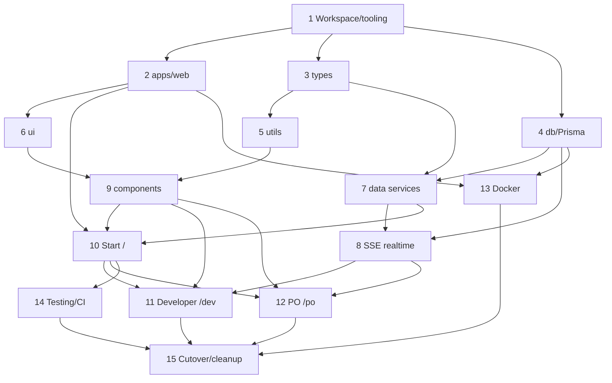

I have enough grounding. Here are the issue drafts.

---

**Plan summary:** Drafting 1 tracking EPIC + 15 child issue drafts that map 1:1 to the spec's "Migration phases → issue breakdown" (matching titles, scope, sizes, and dependency numbers), grounded in the current CRA/PouchDB/Semantic UI codebase. **Nothing is written to GitHub** — review-only.

> Note on numbering: child issues are referenced as `#1..#15` **placeholders** (they aren't created yet). When created, remap to the real issue numbers. The EPIC is `#EPIC`.

---

# EPIC — Migrate Scrum Poker to Next.js 16 + Tailwind + Prisma 7 + SSE realtime (pnpm monorepo, Docker)

```markdown
## Summary
Migrate the legacy Create React App SPA (React 18, `react-router-dom` v6, Semantic UI + SCSS, PouchDB↔CouchDB live sync, `gh-pages` static deploy) to a modern, self-hosted stack: Next.js 16 (App Router, React 19, Server Components), Tailwind + Radix design system, Prisma 7 on PostgreSQL, and Server-Sent Events realtime backed by Postgres `LISTEN/NOTIFY`. Reorganize into a pnpm workspace monorepo (`apps/web` + `packages/db,ui,components,types,utils,config`) deployed via Docker. Product behavior is preserved (create/join by PIN, developers vote, PO manages/reveals estimations, stats, CSV import); no auth, no data migration. Source of truth: `docs/superpowers/specs/2026-07-21-nextjs-migration-design.md`.

## Acceptance Criteria
- [ ] All 15 child issues (#1–#15) are completed and closed.
- [ ] Feature parity verified against legacy app: create/join session by PIN, developer voting, PO estimation management, reveal, `@nivo/pie` stats, CSV import via `papaparse`.
- [ ] Realtime updates work via SSE + Postgres `LISTEN/NOTIFY` (replacing `ApiService.onChange`), including multi-client fan-out and auto-reconnect.
- [ ] App runs from a single `docker-compose up` (Next.js standalone server + Postgres) with healthchecks.
- [ ] Legacy stack fully removed: no `react-scripts`, `pouchdb`, `semantic-ui-*`, SCSS, or `gh-pages` deploy remain in the repo.
- [ ] Negative/edge: one-vote-per-user uniqueness and single-active-estimation invariant hold under concurrent writes; SSE clients survive a listener disconnect and reconnect without duplicate/missed events.

## Technical Description
- Affected areas/files (legacy, to be replaced/retired): `src/api/index.ts` (PouchDB `ApiService`), `src/api/interfaces/index.ts` (nested `ISessionDb`), `src/services/*` (localStorage identity/session), `src/components/*` (Semantic UI), `src/pages/{start,developer,po-page}.tsx`, `src/utils/index.tsx`, `package.json` (CRA/`gh-pages` scripts), `.db/config.json` (pouchdb-server).
- Target: `apps/web` (App Router routes `/`, `/dev`, `/po`, `api/*`), `packages/db` (Prisma 7 + `pg_notify` triggers — sole `@prisma/client` consumer), `packages/ui` (Tailwind/Radix primitives), `packages/components`, `packages/types`, `packages/utils`, `packages/config`.
- Approach: sequence per spec — scaffold workspace/tooling → app shell + types + db → utils/ui/services → SSE + components → routes → docker/CI → cutover. Normalize the nested CouchDB document into `Session → Estimation → Vote` relational tables.
- Risks / unknowns: SSE/`LISTEN/NOTIFY` scaling under a single process; Next.js 16 / React 19 async request API changes; Radix rebuild scope of the Semantic UI surface; concurrency invariants under Postgres.

## Estimate
- Size: XL (rough, non-binding) — Confidence: Medium
- Drivers: Rollup of 15 phases (~5–7 weeks total). Largest drivers are `packages/ui` (L), SSE realtime (L), components (L), and PO route (L). Biggest risk-to-estimate: SSE fan-out correctness and design-system rebuild fidelity.

## Dependencies
- Blocked by: none (kickoff epic).
- Blocks: n/a (parent).
- Related: children #1–#15; spec `docs/superpowers/specs/2026-07-21-nextjs-migration-design.md`.

## Priority & PM Opinion
- Priority: P1
- Recommendation: This is a strategic modernization that removes an unmaintained CRA/PouchDB foundation and an external CouchDB dependency, replacing them with a self-hosted, self-contained realtime stack. It is high-value but high-effort; the risk is concentrated in the realtime layer (#8) and the design-system rebuild (#6/#9). Recommend executing strictly in dependency order, landing a thin vertical slice (create/join → vote → live update) early to de-risk SSE before investing in the full PO surface. Not a P0 because the legacy app still functions; sequence it deliberately rather than rushing.

### Child issue checklist
- [ ] #1 — Scaffold pnpm workspace & tooling (S)
- [ ] #2 — Scaffold `apps/web` Next.js 16 (M, dep: 1)
- [ ] #3 — `packages/types` domain types (XS, dep: 1)
- [ ] #4 — `packages/db` — Prisma 7 + Postgres + pg_notify (M, dep: 1)
- [ ] #5 — `packages/utils` — stats/formatting/CSV helpers (S, dep: 3)
- [ ] #6 — `packages/ui` — Tailwind + Radix primitives + tokens (L, dep: 2)
- [ ] #7 — Data services layer (replace ApiService) (M, dep: 4,3)
- [ ] #8 — SSE realtime (stream route + LISTEN hub + client hook) (L, dep: 4,7)
- [ ] #9 — `packages/components` rebuild in Tailwind (L, dep: 6,5)
- [ ] #10 — Route: Start `/` (M, dep: 2,7,9)
- [ ] #11 — Route: Developer `/dev` (M, dep: 8,9,10)
- [ ] #12 — Route: PO `/po` (L, dep: 8,9,10)
- [ ] #13 — Dockerize & compose (M, dep: 2,4)
- [ ] #14 — Testing & CI (M, dep: multiple)
- [ ] #15 — Cutover & cleanup (S, dep: 10–14)
```

---

# #1 — Scaffold pnpm workspace & tooling

```markdown
## Summary
Convert the single-package CRA repo into a pnpm workspace monorepo and establish shared tooling so all later phases have a consistent home. Create `pnpm-workspace.yaml`, `packages/config` (shared tsconfig/eslint/Tailwind preset), root scripts, and an optional Turbo task runner.

## Acceptance Criteria
- [ ] `pnpm-workspace.yaml` declares `apps/*` and `packages/*`; `pnpm install` resolves cleanly at the root.
- [ ] `packages/config` exports a base `tsconfig` (strict), a shared ESLint config, and a Tailwind preset consumable via `workspace:*`.
- [ ] Scoped naming convention `@scrum-poker/*` is applied; a placeholder package that extends `@scrum-poker/config` type-checks.
- [ ] Root scripts exist for recursive tasks (`pnpm -r build`, `pnpm -r lint`, `pnpm -r test`); optional `turbo.json` wires the task graph.
- [ ] Edge/negative: a deliberately introduced cross-package import cycle (or a strict-mode type error) fails `pnpm -r lint`/type-check rather than passing silently.

## Technical Description
- Affected areas/files: repo root — new `pnpm-workspace.yaml`, `turbo.json`, `packages/config/{tsconfig,eslint,tailwind-preset}`. Existing root `package.json`, `tsconfig.json`, `pnpm-workspace.yaml`, `pnpm-lock.yaml` are reworked; legacy CRA `eslintConfig: { extends: "react-app" }` is superseded.
- Approach: introduce pnpm workspaces; centralize config in `@scrum-poker/config`; internal deps use `workspace:*`. Keep the legacy `src/` intact for now (cutover happens in #15). Enforce the DAG described in the spec (`apps/web → components → ui`, `apps/web → db`, all → `types`/`utils`/`config`).
- Risks / unknowns: repo currently ships both `package-lock.json` and `pnpm-lock.yaml` — decide on pnpm as the single package manager and remove npm lockfile; Node/pnpm version pinning (`.nvmrc`/`packageManager` field).

## Estimate
- Size: S (rough, non-binding) — Confidence: High
- Drivers: Mostly config scaffolding. Larger if we adopt Turbo remote caching or need to untangle the dual lockfile situation.

## Dependencies
- Blocked by: none.
- Blocks: #2, #3, #4 (everything scaffolds into this workspace).
- Related: spec "Monorepo layout".

## Priority & PM Opinion
- Priority: P1
- Recommendation: Foundational and cheap — nothing else can start cleanly without it, so it should be done first and quickly. Low risk, high leverage. Keep it minimal (don't over-invest in Turbo caching yet); the goal is a working workspace + shared config, not a perfect build pipeline.
```

---

# #2 — Scaffold `apps/web` Next.js 16

```markdown
## Summary
Create the Next.js 16 App Router application shell (`apps/web`) with React 19, Server Components by default, Tailwind wired to the shared preset, the Sentry Next.js SDK, and env conventions. This becomes the host for all routes and API handlers.

## Acceptance Criteria
- [ ] `apps/web` boots with `next dev` (Turbopack) and renders a root layout using Tailwind classes from `@scrum-poker/config`'s preset.
- [ ] App Router structure exists with placeholders for `app/(routes)` `/`, `/dev`, `/po`, and `app/api/*`.
- [ ] Sentry Next SDK is initialized for both client and server; a test error is captured.
- [ ] Env conventions documented and enforced: server-only vars vs `NEXT_PUBLIC_*`; `.env` example committed (no secrets).
- [ ] Async request APIs used correctly where present (`await cookies()/headers()/params/searchParams`).
- [ ] Edge/negative: referencing a server-only env var from a client component fails at build/lint time (not silently `undefined` at runtime).

## Technical Description
- Affected areas/files: new `apps/web/app/{layout.tsx,page.tsx,globals.css}`, `apps/web/next.config`, `apps/web/tailwind.config` (extends preset from #1), Sentry config files. Replaces CRA entrypoints `src/index.tsx`, `public/index.html`, `src/App.tsx`, and the `@sentry/react` setup with the Next SDK.
- Approach: `create-next-app`-style scaffold into the workspace; import Tailwind preset from `@scrum-poker/config`; set `output: "standalone"` early (consumed by #13). Establish `"use client"` opt-in discipline.
- Risks / unknowns: Next.js 16 / React 19 API churn (async request APIs, caching defaults); Turbopack edge cases; Sentry Next SDK config surface.

## Estimate
- Size: M (rough, non-binding) — Confidence: Medium
- Drivers: Straightforward scaffold, but Next 16/React 19 novelty and Sentry+env wiring add uncertainty.

## Dependencies
- Blocked by: #1.
- Blocks: #6 (ui), #10 (Start route), #13 (Docker).
- Related: spec "Target architecture", "Error handling".

## Priority & PM Opinion
- Priority: P1
- Recommendation: The backbone of the migration — every UI/route phase depends on it. Do it right after #1. Medium risk lives in Next 16 being relatively new; budget time to read release notes on async request APIs and caching. Keep the shell thin; real UI comes with #6/#9/#10.
```

---

# #3 — `packages/types` — port domain types

```markdown
## Summary
Extract the shared domain model (`Session`, `Estimation`, `Vote`) into a framework-agnostic `packages/types` so app, db, services, and components share one source of truth — normalized from the legacy nested CouchDB document shape.

## Acceptance Criteria
- [ ] `@scrum-poker/types` exports `Session`, `Estimation`, `Vote` (and supporting identity types) with no runtime dependencies.
- [ ] Types reflect the normalized relational model (`Session → Estimation[] → Vote[]`), not the legacy keyed-map shape.
- [ ] Package builds and type-checks standalone; consumable via `workspace:*`.
- [ ] Edge/negative: types encode the invariants used downstream (e.g. `Vote.value` optional/nullable to represent "joined but not yet voted"; one active estimation is representable).

## Technical Description
- Affected areas/files: new `packages/types/src/index.ts`. Ports and normalizes `src/api/interfaces/index.ts` (`ISessionDb`, `IEstimation`, `IVote` — currently `estimations`/`votes` as `{[key: string]: T}` maps) and `IUserInfo` from `src/services/local-user-storage.ts`.
- Approach: define flat/relational types matching the Prisma schema in the spec (fields: `Session.name/pin`, `Estimation.name/description/isActive/isEnded`, `Vote.voterId/voterName/voterEmail/pattern/value`). Keep pure TS types only; no `@prisma/client` imports (that stays in #4).
- Risks / unknowns: keep field naming consistent with Prisma output to avoid mapping layers; decide whether to derive types from Prisma or maintain hand-written shared types (spec favors a dedicated `types` package).

## Estimate
- Size: XS (rough, non-binding) — Confidence: High
- Drivers: Small, mechanical. Slightly larger if we add zod schemas for runtime validation.

## Dependencies
- Blocked by: #1.
- Blocks: #5 (utils), #7 (data services).
- Related: #4 (must stay field-consistent with Prisma schema).

## Priority & PM Opinion
- Priority: P1
- Recommendation: Tiny but unblocks utils and the data layer, and prevents type drift across packages. Do it early and in lockstep with #4 so the shared types and Prisma schema agree on field names. Very low risk.
```

---

# #4 — `packages/db` — Prisma 7 + Postgres (schema, migrations, seed, pg_notify triggers)

```markdown
## Summary
Create `packages/db` as the sole owner of Prisma 7 and the only package importing `@prisma/client`. Define the normalized `Session/Estimation/Vote` schema, migrations, seed, a client singleton, and the Postgres `pg_notify` triggers that feed the SSE realtime layer.

## Acceptance Criteria
- [ ] `schema.prisma` matches the spec model (`Session`, `Estimation`, `Vote`) including `@@unique([estimationId, voterId])`, `@@index` entries, and cascade deletes.
- [ ] `prisma migrate` produces migrations that apply against a clean Postgres; a `seed` script inserts sample data.
- [ ] A client singleton is exported (server-only) preventing connection exhaustion in dev/HMR.
- [ ] DB triggers call `pg_notify('session_<id>', payload)` on `Session`/`Estimation`/`Vote` writes, emitting small event descriptors (e.g. `{ type: 'vote', estimationId }`), not full state.
- [ ] `@scrum-poker/db` is the ONLY package importing `@prisma/client`; it is not importable from client components.
- [ ] Edge/negative: inserting a duplicate `(estimationId, voterId)` is rejected by the unique constraint; deleting a `Session` cascades to its estimations and votes.

## Technical Description
- Affected areas/files: new `packages/db/{prisma/schema.prisma, prisma/migrations, prisma/seed.ts, src/client.ts, src/notify.ts, sql/triggers.sql}`. Replaces the entire PouchDB persistence in `src/api/index.ts` and the nested `ISessionDb` doc from `src/api/interfaces/index.ts`; retires `.db/config.json` (pouchdb-server) and `REACT_APP_API` CouchDB URL usage.
- Approach: model per spec; add SQL migration installing triggers + trigger functions that `pg_notify` per-session channels. Provide a `notify` helper module for the SSE hub (#8) to `LISTEN`. No data migration from CouchDB (non-goal).
- Risks / unknowns: Prisma 7 API/CLI differences; trigger DDL must live in a migration (Prisma doesn't model triggers natively) — ensure it's idempotent; payload contract must be agreed with #8.

## Estimate
- Size: M (rough, non-binding) — Confidence: Medium
- Drivers: Schema is small, but hand-written trigger SQL + Prisma 7 novelty + singleton correctness add work. Larger if we add the single-active-estimation invariant as a DB constraint vs. leaving it to the service layer (#7).

## Dependencies
- Blocked by: #1.
- Blocks: #7 (data services), #8 (SSE realtime), #13 (Docker/Postgres).
- Related: #3 (field-name consistency).

## Priority & PM Opinion
- Priority: P1
- Recommendation: Core of the new stack — the data model and the `pg_notify` contract gate both the service layer and realtime. Prioritize nailing the trigger payload shape and the unique/cascade constraints, since #7 and #8 build directly on them. Medium risk from Prisma 7 being new and trigger SQL living outside Prisma's model; validate migrations against a throwaway Postgres early.
```

---

# #5 — `packages/utils` — stats/formatting + CSV helpers (with tests)

```markdown
## Summary
Extract pure helper functions into `packages/utils`: estimation statistics (average, min/max, devs-voted), time formatting, and CSV parsing for estimation import — all as framework-free, unit-tested functions.

## Acceptance Criteria
- [ ] `@scrum-poker/utils` exports stats helpers (average, min/max, devs-voted ratio), `timeFormat`, and a CSV→estimations parser using `papaparse`.
- [ ] Functions are pure (no React, no DOM, no Semantic UI) and operate on `@scrum-poker/types` shapes.
- [ ] Jest unit tests cover happy paths and edge cases; `pnpm --filter utils test` passes.
- [ ] Edge/negative: stats ignore non-numeric votes (e.g. "?"/coffee) when computing average/min-max (mirrors legacy `filterInvalidEstimations`); malformed CSV rows are rejected/reported, not silently imported.

## Technical Description
- Affected areas/files: new `packages/utils/src/{stats.ts,format.ts,csv.ts,index.ts}` + tests. Ports logic from `src/components/est-statistics/est-statistics.tsx` (`filterInvalidEstimations`, `getDevsVoted`, `getMinMax`, `getEstimationAverage`), `timeFormat` from `src/utils/index.tsx`, and the CSV parsing currently inline in the PO page/import flow (`papaparse` + `src/components/import-zone/import-zone.tsx`).
- Approach: rewrite the stats math against normalized `Vote[]` (array) instead of the legacy `votes` map; keep numeric-filtering behavior identical. Drop the legacy `withRouter`/`history` helper (Next uses its own router).
- Risks / unknowns: exact CSV column contract for imported estimations (name/description) must be pinned; ensure locale-dependent `timeFormat` is acceptable or make it deterministic for tests.

## Estimate
- Size: S (rough, non-binding) — Confidence: High
- Drivers: Small, well-isolated logic. Slightly larger due to test coverage and CSV schema definition.

## Dependencies
- Blocked by: #3.
- Blocks: #9 (components use stats/formatting), #12 (PO CSV import).
- Related: spec "Error handling & testing".

## Priority & PM Opinion
- Priority: P2
- Recommendation: Low-risk, high-clarity extraction that pays off in #9/#12. Because it's pure logic, it's the ideal place to establish the testing pattern for the whole monorepo. Not urgent enough to block the critical path, but cheap enough to do alongside early phases.
```

---

# #6 — `packages/ui` — Tailwind + Radix primitives + theme tokens

```markdown
## Summary
Build the design system in `packages/ui`: unstyled-but-accessible Radix primitives styled with Tailwind and centralized theme tokens (colors, spacing, radii, shadows, gradients, motion). This replaces Semantic UI React entirely and provides the primitives (Button, Card, Modal, Table, Reveal, etc.) that `packages/components` composes.

## Acceptance Criteria
- [ ] `@scrum-poker/ui` exports at least Button, Card, Modal/Dialog, Table, and Reveal primitives built on Radix + Tailwind, using icons from `lucide-react`.
- [ ] All visual values come from centralized theme tokens (in the Tailwind preset / `packages/config`); no inline styles, no SCSS, no CSS-in-JS.
- [ ] Primitives are accessible (keyboard/focus/ARIA via Radix) and render in a Storybook or example route.
- [ ] Zero dependency on `semantic-ui-react`/`semantic-ui-css`.
- [ ] Edge/negative: Modal/Dialog traps focus and closes on Escape/overlay click; components render correctly in a Server Component context with `"use client"` applied only where interactivity requires it.

## Technical Description
- Affected areas/files: new `packages/ui/src/*` + token definitions extending the Tailwind preset from #1/#2. Replaces Semantic UI usage found throughout `src/components/*` (e.g. `Statistic`, `List`, `Message`, `Table`, `Card`, `Modal`) and the per-component `*.scss` files.
- Approach: map the current Semantic UI surface to a minimal Radix + Tailwind primitive set; define tokens once; keep primitives presentational and composable. Coordinate with the Component Design Modernizer agent on visual language.
- Risks / unknowns: scope creep — enumerate exactly which Semantic UI components are actually used before building; Radix + RSC boundary correctness; matching legacy "reveal" animation behavior.

## Estimate
- Size: L (rough, non-binding) — Confidence: Medium
- Drivers: Breadth of primitives and token system design. Larger if we chase pixel-parity with Semantic UI or add Storybook infra; smaller if we build only the primitives #9 actually needs.

## Dependencies
- Blocked by: #2.
- Blocks: #9 (components).
- Related: spec "Styling" decisions; Component Design Modernizer agent.

## Priority & PM Opinion
- Priority: P1
- Recommendation: One of the two largest risk centers (with #8). It gates all composed components and therefore every route. Recommend scoping strictly to the primitives the app actually uses (audit `src/components/*` imports first) to avoid building a general-purpose library. Invest in tokens up front since retrofitting them later is expensive. Start it as soon as #2 lands.
```

---

# #7 — Data services layer (replace `ApiService`)

```markdown
## Summary
Implement the Prisma-backed service layer that replaces the PouchDB `ApiService`: session/estimation/vote CRUD, the "single active estimation per session" transaction, and CSV import — all server-side, consuming `@scrum-poker/db` and `@scrum-poker/types`.

## Acceptance Criteria
- [ ] Services expose: create/get/delete session; create/update/delete/import estimation; cast/change vote; activate estimation.
- [ ] Activating one estimation atomically deactivates all others in the same session (transaction), preserving the legacy `updateEstimation` invariant.
- [ ] Voting enforces one vote per user per estimation and supports vote changes (upsert on `(estimationId, voterId)`).
- [ ] Services are server-only and never imported into client components.
- [ ] Edge/negative: concurrent activations of different estimations in one session converge to exactly one active; a duplicate vote does not create a second row (upsert/uniqueness), and a re-vote updates the existing value.

## Technical Description
- Affected areas/files: new `apps/web/lib/services/*` (or `packages/db`-adjacent server module) implementing behavior currently in `src/api/index.ts`: `post/getSession/update/delete`, `getEstimation`, `vote`, `importEstimations`, `createNewEstimation`, `updateEstimation` (the "set all others inactive" reduce), `deleteEstimation`. Consumes Prisma client from #4.
- Approach: reimplement each `ApiService` method against normalized tables; move the single-active-estimation logic into a Prisma `$transaction`; replace the localStorage-coupled `IUserInfo` vote path with explicit `voterId/voterName/voterEmail/pattern`. Writes trigger `pg_notify` (via #4 triggers), which feeds #8.
- Risks / unknowns: exact transaction/isolation level needed for the single-active invariant; whether to enforce via DB constraint vs. service transaction; import merge semantics vs. legacy `Object.assign`.

## Estimate
- Size: M (rough, non-binding) — Confidence: Medium
- Drivers: Direct port of ~10 methods, but the transactional invariants and vote upsert semantics require care and tests.

## Dependencies
- Blocked by: #4, #3.
- Blocks: #8 (realtime reads/writes), #10 (Start route), #11/#12 (routes consume services).
- Related: legacy `src/api/index.ts`.

## Priority & PM Opinion
- Priority: P1
- Recommendation: This is the behavioral heart of the app — it must faithfully reproduce the legacy `ApiService` semantics, especially single-active-estimation and one-vote-per-user. Prioritize right after #4. Pair it with focused tests for the two invariants (they're the most likely regression source and are explicitly called out in the spec). Medium risk from concurrency edge cases.
```

---

# #8 — SSE realtime (`/api/sessions/[id]/stream` + LISTEN hub + client hook)

```markdown
## Summary
Replace PouchDB live changes (`ApiService.onChange`) with Server-Sent Events backed by Postgres `LISTEN/NOTIFY`. Implement the SSE route handler, a single per-process `pg` listener that fans out notifications to subscribed clients via an in-memory hub, and a client `EventSource` hook that revalidates on events.

## Acceptance Criteria
- [ ] `GET /api/sessions/[id]/stream` returns a valid SSE stream (`text/event-stream`) that a browser `EventSource` can consume.
- [ ] One shared long-lived `pg` client per Node process `LISTEN`s to session channels; an in-memory hub maps `sessionId → Set<subscriber>` and fans out `pg_notify` payloads.
- [ ] Heartbeat comment (~25s) keeps connections alive; client auto-reconnects using `Last-Event-ID`.
- [ ] On disconnect of the last client for a session, the subscriber is removed and the channel `UNLISTEN`ed.
- [ ] A client hook exposes live updates and triggers revalidation (`router.refresh()` / SWR) or delivers the changed slice; behavior matches legacy `onChange` 1:1.
- [ ] Edge/negative: two clients on the same session both receive a vote event exactly once; if the listener connection drops, it reconnects and resumes without leaking subscribers or duplicating events; a client for a non-existent session gets a clean close, not a hang.

## Technical Description
- Affected areas/files: new `apps/web/app/api/sessions/[id]/stream/route.ts`, a process-singleton listener/hub module (consuming `packages/db`'s `notify` helper from #4), and a client `useSessionStream` hook. Replaces `ApiService.onChange` (`db.changes({ since: "now", live: true })`) in `src/api/index.ts` and all its consumers in `src/pages/{developer,po-page}.tsx`.
- Approach: per spec read/write paths — write → Prisma → trigger `pg_notify('session_<id>', json)`; read → SSE handler subscribes via the shared listener; small event descriptors trigger client revalidation. Requires long-lived Node runtime (satisfied by #13's Docker deploy, `output: standalone`).
- Risks / unknowns: correctness of the fan-out/cleanup under reconnects; behavior across multiple processes/instances (single-process assumption per spec — document scaling limits); proxy buffering of SSE; `params` is async in Next 16 (`await params`).

## Estimate
- Size: L (rough, non-binding) — Confidence: Low
- Drivers: Realtime plumbing, connection lifecycle, and reconnect/cleanup correctness are the hardest, least-deterministic part of the migration. Low confidence pending a working spike.

## Dependencies
- Blocked by: #4, #7.
- Blocks: #11 (Developer live voting), #12 (PO live stats/reveal).
- Related: spec "Real-time design"; #13 (runtime requirement).

## Priority & PM Opinion
- Priority: P0
- Recommendation: The single highest-risk phase and a hard requirement for feature parity (live updates are core to a poker app). I'd treat it as a P0 spike: build a minimal end-to-end slice (one write → one client update) before the full routes to validate the `pg_notify` → hub → `EventSource` path and the reconnect/cleanup semantics. Get this working early; if the SSE approach proves fragile at our scale, that discovery must happen before #11/#12 are built on top of it.
```

---

# #9 — `packages/components` — rebuild composed components in Tailwind

```markdown
## Summary
Rebuild the composed app components — poker-card, votes-table, estimation-chart (`@nivo/pie`), est-statistics, card-reveal, and import-zone — on top of `packages/ui` primitives and `packages/utils`, styled entirely with Tailwind/tokens (no Semantic UI, no SCSS).

## Acceptance Criteria
- [ ] `@scrum-poker/components` exports poker-card, votes-table, estimation-chart, est-statistics, card-reveal, and import-zone, composed from `@scrum-poker/ui` primitives.
- [ ] Statistics and formatting come from `@scrum-poker/utils`; charts use `@nivo/pie`; CSV drop uses `react-dropzone`.
- [ ] No component imports `semantic-ui-react`/`semantic-ui-css` or references `*.scss`.
- [ ] Component render tests (Testing Library) cover each component's happy path.
- [ ] Edge/negative: votes-table/est-statistics render correctly with zero votes and with non-numeric votes; card-reveal correctly toggles hidden↔revealed state.

## Technical Description
- Affected areas/files: new `packages/components/src/*` + tests. Ports and rewrites `src/components/poker-card/poker-card.tsx`, `votes-table/votes-table.tsx`, `estimation-chart/estimation-chart.tsx`, `est-statistics/est-statistics.tsx` (Semantic `Statistic`/`List`), `card-reveal/card-reveal.tsx`, `estimations/estimations.tsx`, and `import-zone/import-zone.tsx` (Semantic `Message`). Replaces `src/components/index.ts` barrel.
- Approach: convert class components to function components where sensible; move math to `@scrum-poker/utils` (#5); consume Radix/Tailwind primitives from #6; apply `"use client"` only where interactivity (dropzone, reveal, chart) requires it.
- Risks / unknowns: `@nivo/pie` behavior under RSC (`"use client"` boundary); matching legacy reveal animation; exact data shape passed from routes.

## Estimate
- Size: L (rough, non-binding) — Confidence: Medium
- Drivers: Six components to rebuild plus tests. Larger if visual parity with Semantic UI is required; dependent on #6 primitive completeness.

## Dependencies
- Blocked by: #6, #5.
- Blocks: #10, #11, #12 (all routes compose these).
- Related: Component Design Modernizer agent; spec "Routes".

## Priority & PM Opinion
- Priority: P1
- Recommendation: The bridge between the design system and the routes — nothing user-facing ships without it. Sequence it right after #6; its size is real, so consider landing components in the order the routes need them (poker-card/votes-table first for #11, chart/stats/import for #12) to unblock route work in parallel. Medium risk, mostly in chart/reveal interactivity under RSC.
```

---

# #10 — Route: Start `/` (session create/join + local identity)

```markdown
## Summary
Implement the Start route `/`: create a new session or join an existing one by PIN, and capture/store lightweight local identity (username + email/gravatar) in localStorage. This is the entry point and the first end-to-end vertical slice.

## Acceptance Criteria
- [ ] `/` lets a user create a session (optional name/PIN) and join an existing session by PIN.
- [ ] Local identity (username + email, derived gravatar/pattern, generated `voterId`) is captured and persisted in localStorage; returning users are recognized.
- [ ] Successful create/join navigates to `/dev` or `/po` with the session context.
- [ ] Recently accessed sessions are remembered client-side (parity with legacy `LocalSessionApi`).
- [ ] Edge/negative: joining with a wrong/empty PIN shows a user-facing error (toast) and does not navigate; creating without an identity prompts for one first.

## Technical Description
- Affected areas/files: new `apps/web/app/page.tsx` (+ `"use client"` form island) and identity/session client storage modules. Replaces `src/pages/start.tsx`/`start.scss`, and ports `src/services/local-user-storage.ts` (`LocalUserInfoApi`, `IUserInfo`) and `src/services/local-session-storage.ts` (`LocalSessionApi`, `ISessionAccess`) to the new `voterId/voterName/voterEmail` model.
- Approach: server action / route handler for create/join calling the data services (#7); client-side localStorage for identity; use `@scrum-poker/components`/`ui` for the form and session list.
- Risks / unknowns: identity id generation (was `uuid`); how PIN validation maps to service queries; SSR vs client boundary for localStorage access.

## Estimate
- Size: M (rough, non-binding) — Confidence: Medium
- Drivers: First real integration of services + components + client storage. Larger if we polish the session-history UX.

## Dependencies
- Blocked by: #2, #7, #9.
- Blocks: #11, #12 (both start from a joined session), #14, #15.
- Related: legacy `src/services/*`, `src/pages/start.tsx`.

## Priority & PM Opinion
- Priority: P1
- Recommendation: The first user-facing vertical slice and the gateway to both role routes — prioritize it as soon as #7/#9 are ready. It's also the natural place to prove the create→join→navigate flow end-to-end before layering realtime. Medium risk, mostly around the SSR/localStorage boundary for identity.
```

---

# #11 — Route: Developer `/dev` (voting UI, live via SSE)

```markdown
## Summary
Implement the Developer route `/dev`: show the active estimation and let a developer cast/change a vote, with live updates via the SSE stream so all participants see votes and estimation changes in real time.

## Acceptance Criteria
- [ ] `/dev` displays the current active estimation and a set of poker cards for voting.
- [ ] Casting a vote persists via the data services and reflects immediately for the voter; changing a vote updates in place.
- [ ] Live SSE updates push new votes / estimation activation / reveal state to the developer view without manual refresh.
- [ ] When no estimation is active, the view shows an appropriate waiting state.
- [ ] Edge/negative: a developer can only have one recorded vote per estimation (re-vote overwrites, not duplicates); if the SSE connection drops it reconnects and the view converges to server state.

## Technical Description
- Affected areas/files: new `apps/web/app/dev/page.tsx` (+ client voting island) using the `useSessionStream` hook from #8 and poker-card/votes-table from #9. Replaces `src/pages/developer.tsx`/`developer.scss`, `src/components/dev-estimation/*`, and `src/components/dev-sign-in/*`; replaces the PouchDB `vote`/`onChange` calls in the legacy developer page.
- Approach: server component fetches initial active estimation via services (#7); client island subscribes to SSE (#8) and revalidates on events; votes go through the service upsert.
- Risks / unknowns: initial-load vs live-update reconciliation (avoid flicker/double state); identity/voterId sourcing from localStorage into the vote call.

## Estimate
- Size: M (rough, non-binding) — Confidence: Medium
- Drivers: Voting flow + live reconciliation. Larger if optimistic UI is desired.

## Dependencies
- Blocked by: #8, #9, #10.
- Blocks: #15.
- Related: legacy `src/pages/developer.tsx`.

## Priority & PM Opinion
- Priority: P1
- Recommendation: Core participant experience and the best real-world test of the SSE layer — build it right after #8/#10 to validate realtime under actual voting load. Recommend keeping optimistic UI out of the first pass (revalidate-on-event is simpler and proves parity) and adding it only if latency feels poor. Medium risk tied to #8's maturity.
```

---

# #12 — Route: PO `/po` (manage estimations, reveal, stats, CSV import)

```markdown
## Summary
Implement the Product Owner route `/po`: create/edit/delete/activate estimations, reveal votes, view statistics (`@nivo/pie` + numeric stats), and import estimations from a CSV file — all live via SSE.

## Acceptance Criteria
- [ ] `/po` lists a session's estimations and supports create, edit, delete, and activate (activation enforces single-active via the service transaction from #7).
- [ ] Reveal toggles votes from hidden to shown; revealed state propagates to developers via SSE.
- [ ] Statistics render: devs-voted ratio, min/max, average (non-numeric votes excluded) plus the `@nivo/pie` distribution chart.
- [ ] CSV import via drag-and-drop parses rows (`papaparse`) into estimations and persists them.
- [ ] Live SSE updates reflect incoming votes and state changes in the PO view.
- [ ] Edge/negative: activating a second estimation deactivates the previous one (exactly one active); a malformed CSV surfaces a parse error toast and imports nothing (no partial/garbage rows).

## Technical Description
- Affected areas/files: new `apps/web/app/po/page.tsx` (+ client islands) composing estimations, votes-table, estimation-chart, est-statistics, card-reveal, and import-zone from #9; stats/CSV from #5; live via #8. Replaces `src/pages/po-page.tsx`/`po-page.scss` and its PouchDB `createNewEstimation`/`updateEstimation`/`deleteEstimation`/`importEstimations`/`onChange` usage.
- Approach: server component loads estimations via services; client islands handle create/edit/activate/reveal/import and SSE subscription; CSV parsed client-side then persisted through the import service (#7).
- Risks / unknowns: CSV column contract (must match #5); reveal-state modeling (`isEnded`/reveal flag); chart under `"use client"`; largest UI surface of the app.

## Estimate
- Size: L (rough, non-binding) — Confidence: Medium
- Drivers: Broadest feature set (CRUD + reveal + stats + chart + import + live). Larger if estimation editing UX is elaborate.

## Dependencies
- Blocked by: #8, #9, #10.
- Blocks: #15.
- Related: legacy `src/pages/po-page.tsx`, `src/components/import-zone/*`, `est-statistics/*`, `estimation-chart/*`.

## Priority & PM Opinion
- Priority: P1
- Recommendation: The richest surface and the counterpart to #11 — together they complete feature parity. Because it bundles several features, recommend slicing internally (CRUD+activate first, then reveal+stats, then CSV import) so progress is reviewable and the single-active invariant gets early exercise. Medium risk spread across many small integrations rather than one hard problem.
```

---

# #13 — Dockerize & compose

```markdown
## Summary
Package the app for self-hosted deployment: a Docker image running the Next.js standalone Node server (required for SSE + `LISTEN/NOTIFY`) alongside Postgres via `docker-compose`, with healthchecks and env configuration.

## Acceptance Criteria
- [ ] `apps/web/Dockerfile` builds the Next.js standalone output into a runnable image.
- [ ] `docker-compose.yml` starts `web` + `postgres`; `docker-compose up` brings the app to a working state with a reachable database.
- [ ] Postgres runs Prisma migrations (or an init/entrypoint step) so schema + `pg_notify` triggers are present on first boot.
- [ ] Healthchecks exist for web and postgres; web waits for a healthy DB before serving.
- [ ] Env is passed via compose (no secrets committed); a `.env.example` documents required vars.
- [ ] Edge/negative: SSE connections survive across the compose network (no proxy buffering breaks the stream); killing/restarting the web container reconnects cleanly to Postgres and re-establishes `LISTEN`.

## Technical Description
- Affected areas/files: new `apps/web/Dockerfile`, root `docker-compose.yml`, `.dockerignore`, entrypoint/migration step consuming `packages/db` (#4). Requires `output: "standalone"` from #2. Replaces the legacy `gh-pages` static deploy and the `pouchdb-server` dev DB (`.db/config.json`).
- Approach: multi-stage build (pnpm install/build → standalone runtime image); compose wires `DATABASE_URL` to the postgres service; run migrations on startup; long-lived Node runtime satisfies the SSE/LISTEN requirement.
- Risks / unknowns: pnpm workspace + Next standalone tracing of workspace deps in Docker; migration-on-boot strategy; ensuring SSE isn't buffered by any reverse proxy in front of the container.

## Estimate
- Size: M (rough, non-binding) — Confidence: Medium
- Drivers: Standalone + monorepo Docker builds are fiddly; migration bootstrapping and healthcheck ordering add work.

## Dependencies
- Blocked by: #2, #4.
- Blocks: #15 (cutover retires gh-pages once Docker deploy works); enables production realtime runtime for #8.
- Related: spec "Deploy".

## Priority & PM Opinion
- Priority: P1
- Recommendation: The deploy target that makes SSE viable in production (a long-lived Node runtime), so it's more than packaging — it's a functional requirement for realtime. Can proceed in parallel once #2/#4 exist, before all routes are done, to shake out the standalone+monorepo build early. Medium risk from pnpm workspace tracing in Docker; validate the SSE stream through the container, not just locally.
```

---

# #14 — Testing & CI

```markdown
## Summary
Establish per-package testing with Jest + `@testing-library/react`, a workspace-level test script, and a GitHub Actions pipeline that lints, type-checks, and tests every package on push/PR.

## Acceptance Criteria
- [ ] Jest + Testing Library configured in each package that needs it (utils pure-function tests, component render tests, service/data tests).
- [ ] `pnpm -r test` runs the full suite from the root; individual `pnpm --filter <pkg> test` works.
- [ ] A GitHub Actions workflow runs install → lint → type-check → test on push and PR against a Postgres service container for data tests.
- [ ] Coverage includes the two spec-mandated invariants: one-vote-per-user uniqueness and single-active-estimation.
- [ ] Edge/negative: CI fails (red) when the uniqueness or single-active invariant is violated, and when type-check/lint errors are introduced.

## Technical Description
- Affected areas/files: new `.github/workflows/ci.yml`, per-package `jest.config`, test setup in `packages/config`. Replaces the CRA `react-scripts test` setup (`src/setupTests.ts`, `src/App.test.tsx`) and the `react-app` ESLint preset.
- Approach: shared Jest preset in `@scrum-poker/config`; Testing Library for components (#9) and routes; a Postgres service in CI for `packages/db`/services (#7) tests including the invariants; wire Turbo/`pnpm -r` task graph.
- Risks / unknowns: testing SSE/`EventSource` (#8) is awkward — may need integration-style tests; ESM/Next 16 transform config for Jest; CI Postgres + migration bootstrapping.

## Estimate
- Size: M (rough, non-binding) — Confidence: Medium
- Drivers: Per-package config plumbing + a DB-backed CI job. Larger if we attempt realtime/E2E coverage.

## Dependencies
- Blocked by: multiple (needs testable surface — at minimum #5, #7, #9, #10; DB tests need #4).
- Blocks: #15 (green CI is a cutover gate).
- Related: spec "Error handling & testing".

## Priority & PM Opinion
- Priority: P2
- Recommendation: Essential for confidence at cutover, but it trails feature work by nature since it needs something to test. Recommend seeding the Jest config early (with #5) so tests accrue continuously rather than as a big-bang phase, and reserving this issue for the CI pipeline + invariant coverage. P2 because it's a quality gate, not a user-facing blocker — but it must be green before #15.
```

---

# #15 — Cutover & cleanup

```markdown
## Summary
Complete the migration: remove the legacy CRA/PouchDB/Semantic UI code and tooling, update the README/docs, and retire the `gh-pages` deploy in favor of the Docker deployment. This is the final flip to the new stack.

## Acceptance Criteria
- [ ] Legacy `src/` (CRA app, PouchDB `ApiService`, Semantic UI components, SCSS, pages) is removed; the repo builds/runs solely from `apps/web` + `packages/*`.
- [ ] Legacy deps and scripts removed from manifests: `react-scripts`, `pouchdb`/`pouchdb-server`, `semantic-ui-*`, `sass`, `react-app-env`, `gh-pages`, `predeploy/deploy/server` scripts, `.db/config.json`.
- [ ] README documents the new stack, local dev (`pnpm`), and `docker-compose` deployment; the old CouchDB/gh-pages instructions are gone.
- [ ] `gh-pages` deployment is retired; deployment is via the Docker image/compose from #13.
- [ ] CI is green and feature parity is confirmed against the legacy behavior.
- [ ] Edge/negative: a fresh clone can go from zero to running app using only the documented steps (no lingering references to removed packages/scripts; no dead imports).

## Technical Description
- Affected areas/files: delete legacy `src/**`, `public/index.html`/`manifest.json`, `.db/*`, CRA config; prune root `package.json` scripts/deps (`start`, `build`, `test`, `deploy`, `predeploy`, `server`, `homepage`) and the dual `package-lock.json`; rewrite `README.md`. Confirm nothing in `apps/web`/`packages/*` still imports from the old `src/api`, `src/services`, `src/components`, or `semantic-ui-react`.
- Approach: do this only after routes (#10–#12), Docker (#13), and CI (#14) are proven; grep for residual legacy imports/scripts; verify a clean-clone bootstrap.
- Risks / unknowns: hidden references to removed modules; ensuring no CI/deploy workflow still targets `gh-pages`.

## Estimate
- Size: S (rough, non-binding) — Confidence: High
- Drivers: Mostly deletion and docs. Larger only if residual coupling to legacy modules surfaces.

## Dependencies
- Blocked by: #10, #11, #12, #13, #14.
- Blocks: none (final phase).
- Related: entire epic.

## Priority & PM Opinion
- Priority: P2
- Recommendation: The satisfying finish line, but strictly last — removing the legacy app before parity + Docker + CI are proven would burn the safety net. Low effort, low risk once its dependencies land. Gate it on green CI and a manual parity pass, then delete decisively so the repo isn't left in a confusing half-migrated state.
```

---

## Estimate / Priority rollup

| # | Issue | Size | Confidence | Priority | Blocked by |
|---|-------|------|-----------|----------|-----------|
| EPIC | Migration epic | XL | Medium | P1 | — |
| 1 | Scaffold pnpm workspace & tooling | S | High | P1 | — |
| 2 | Scaffold `apps/web` Next.js 16 | M | Medium | P1 | 1 |
| 3 | `packages/types` domain types | XS | High | P1 | 1 |
| 4 | `packages/db` — Prisma 7 + pg_notify | M | Medium | P1 | 1 |
| 5 | `packages/utils` — stats/CSV | S | High | P2 | 3 |
| 6 | `packages/ui` — Tailwind/Radix + tokens | L | Medium | P1 | 2 |
| 7 | Data services layer | M | Medium | P1 | 4, 3 |
| 8 | SSE realtime | L | Low | **P0** | 4, 7 |
| 9 | `packages/components` rebuild | L | Medium | P1 | 6, 5 |
| 10 | Route: Start `/` | M | Medium | P1 | 2, 7, 9 |
| 11 | Route: Developer `/dev` | M | Medium | P1 | 8, 9, 10 |
| 12 | Route: PO `/po` | L | Medium | P1 | 8, 9, 10 |
| 13 | Dockerize & compose | M | Medium | P1 | 2, 4 |
| 14 | Testing & CI | M | Medium | P2 | 5,7,9,10 (multiple) |
| 15 | Cutover & cleanup | S | High | P2 | 10,11,12,13,14 |

**Rough sequence (from spec):** 1 → 2/3/4 → 5/6/7 → 8/9 → 10 → 11/12 → 13/14 → 15
**Total rough effort:** ~5–7 weeks (XL epic). Risk concentrated in #8 (P0, Low confidence), #6, #9, #12.

## Dependency graph



---

**These are drafts only — nothing was written to GitHub and the `github-issues` skill was not invoked.** On your approval, I'll create them via the `github-issues` skill (searching for duplicates first), create the EPIC last-or-first as you prefer, and remap the `#1..#15` placeholders to the real issue numbers in every cross-reference. Flag any titles, sizes, priorities (e.g. whether #8 should really be P0), or scope you want changed before I write.