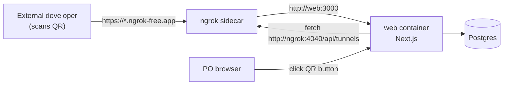

# QR public invite — design

## Problem

The Product Owner can already share a "Copy invite link" for developers on the
same network. There is no way for developers **outside** the local
network/LAN to join a session — the app is only reachable at
`http://localhost:3000` (or a LAN IP) when run via local docker-compose.

## Goal

Add a button in the PO session header that opens a dialog showing a QR code
(and raw URL) developers can scan to join the session from anywhere, backed by
a temporary public tunnel to the local dockerized app.

## Non-goals

- No permanent/production public hosting — this is a *temporary* local-dev
  convenience (tunnel URL changes every `docker compose` restart).
- No new PIN-setting UI (sessions can already carry a PIN at creation time;
  this feature only *surfaces* a warning if one isn't set).
- No support for exposing the app publicly outside of docker-compose (e.g.
  plain `pnpm dev` without the `ngrok` sidecar) — the QR button will show a
  clear error in that case instead of silently failing.

## Architecture



1. `docker-compose.yml` gains an `ngrok` service (official `ngrok/ngrok`
   image), running `http web:3000`, always-on alongside `db` and `web`.
2. ngrok's local API (`:4040/api/tunnels`) is reachable from the `web`
   container over the compose network at `http://ngrok:4040/api/tunnels`.
3. A new server action in the web app fetches that API to resolve the current
   public HTTPS tunnel URL, and builds the developer join link
   (`<publicUrl>/dev?session=<id>`) — the same target as the existing "Copy
   invite link" button, just with a public host instead of
   `window.location.origin`.
4. A new `QrInviteButton` in the PO session header opens a dialog that calls
   the server action and renders the result as a QR code (`react-qr-code`)
   plus the raw URL.

## Components

### 1. `docker-compose.yml` — `ngrok` service

```yaml
ngrok:
  image: ngrok/ngrok:latest
  restart: unless-stopped
  command: ["http", "web:3000"]
  environment:
    NGROK_AUTHTOKEN: ${NGROK_AUTHTOKEN:?Set NGROK_AUTHTOKEN in .env to enable public QR invites}
  depends_on:
    web:
      condition: service_healthy
```

- Depends on: nothing else changes about `db`/`web`.
- Uses: `NGROK_AUTHTOKEN` from `.env` (documented in `.env.example`, left
  blank there — user must supply their own token; never hardcoded/committed).
- `:?` compose syntax fails `docker compose up` for the `ngrok` service with a
  clear message if unset, rather than silently starting a broken tunnel — but
  does **not** block `db`/`web` from starting (they don't depend on `ngrok`).

### 2. Server action — `getPublicJoinUrlAction`

Location: `apps/web/app/(product-owner)/actions.ts`.

```ts
export async function getPublicJoinUrlAction(
  sessionId: string,
): Promise<{ ok: true; url: string } | { ok: false; error: string }>
```

- Fetches `process.env.NGROK_API_URL ?? "http://ngrok:4040/api/tunnels"`.
- Parses the JSON `{ tunnels: [{ public_url, proto }] }` response, picks the
  `https` tunnel.
- On success, returns `{ ok: true, url: `${publicUrl}${sessionHref("dev", sessionId)}` }`
  (reuses the existing `sessionHref` helper from `lib/session-route.ts` — same
  path contract as `CopyInviteButton`).
- On any failure (network error, non-200, no tunnels array, no https tunnel),
  returns `{ ok: false, error: <human-readable message> }`. Distinguish at
  least: "tunnel not reachable" (ngrok container not running / not part of
  this compose stack) vs "no active tunnel yet" (ngrok still starting).

### 3. UI — `QrInviteButton` (in `po-room.tsx`)

- Rendered next to the existing `CopyInviteButton` in the session header bar
  (same flex container, ~line 548 today).
- A `Button` (icon: `QrCode` from `lucide-react`, already a project
  dependency) that opens a `Dialog` (existing `@scrum-poker/ui` primitive).
- On dialog open (`onOpenChange(true)`), calls `getPublicJoinUrlAction` inside
  a `useTransition`:
  - **Loading:** existing `Spinner` component + "Generating public link…".
  - **Success:** renders:
    - `<QRCode value={url} />` from `react-qr-code` (SVG, no canvas, easy to
      theme via `fgColor`/`bgColor`/`style` — no extra runtime deps beyond
      the package itself).
    - The raw URL as selectable text + a small copy button (mirrors
      `CopyInviteButton`'s copy/check icon toggle pattern).
    - If `!session.pin`, an inline warning row: "This session has no PIN —
      anyone with this link can join."
  - **Error:** inline error text + a "Retry" button that re-invokes the
    action. Error copy hints at the docker-compose + `NGROK_AUTHTOKEN`
    requirement.
- Dialog does not auto-poll; PO can close/reopen or hit Retry to refresh.

### 4. Env / docs

- `.env.example`: add (blank, documented) `NGROK_AUTHTOKEN` and
  (documented, defaulted) `NGROK_API_URL`.
- `README.md`: document the new "Public QR invite" feature, and that it
  requires a free ngrok account/authtoken when running via docker-compose.

## Error handling summary

| Condition | User-facing result |
|---|---|
| `ngrok` container not part of stack / unreachable | Error state: "Public link unavailable — is the app running via `docker compose` with the ngrok tunnel?" |
| `NGROK_AUTHTOKEN` missing | `ngrok` service fails to start (compose-level error), so same unreachable error surfaces in the dialog |
| Tunnel still starting | Error state: "Tunnel not ready yet" + Retry |
| Fetch succeeds, no PIN on session | Success state + inline non-blocking warning |

## Testing plan

- **`getPublicJoinUrlAction`** (unit, mocking `fetch`):
  - Happy path: tunnels array with an `https` entry → correct joined URL.
  - No tunnels yet → `ok: false` with "not ready" error.
  - Network/non-200 error → `ok: false` with "unreachable" error.
- **`QrInviteButton`** (component test, mocking the action):
  - Opening the dialog shows loading then renders the QR code + URL on
    success.
  - Error state renders the error + Retry, and Retry re-invokes the action.

## Out of scope / follow-ups

- Reserved/static ngrok domains (paid ngrok feature) — not needed for a
  temporary dev convenience.
- Auto-refreshing the tunnel URL in the dialog while open.
- Adding PIN-setting UI to the PO room (tracked as a possible separate
  enhancement, not part of this feature).
